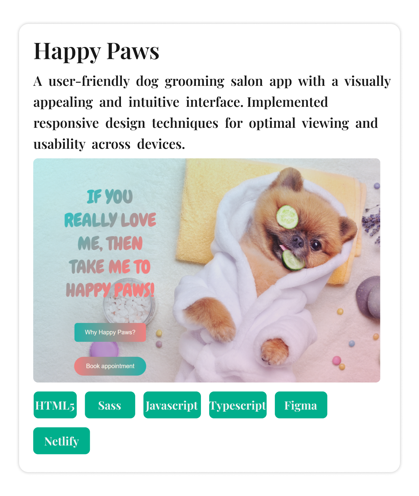

# Hung Le

**`Fullstack Developer`**

Hi, I'm Hung. A fullstack developer who passionate and excited about creating website and applications that make positive impacts to people life. Skilled in JavaScript, TypeScript, HTML, CSS/Sass, React.js, and Express.js. Experienced in database management using MySQL and Sequelize. Collaborative, detail-oriented, and constantly expanding knowledge in software engineering.

:mailbox: Contact me here!

	
	
	

## Projects

## Technologies and Tools
  
<strong>Programming Languages:</strong>

<strong>Front-End Technologies:</strong>

<strong>Back-end Technologies:</strong>

<strong>Databases:</strong>

<strong>Others:</strong>

